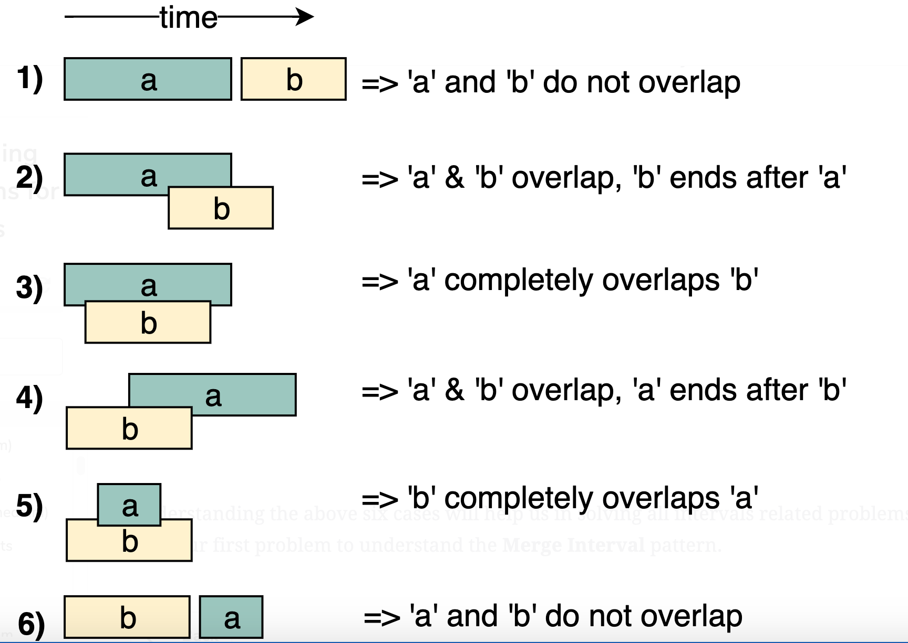

# Summary
Given two intervals (`a` and `b`), there will be six different ways the two intervals can relate to each other:

# 1D
## Merge Intervals
https://leetcode.com/problems/merge-intervals/

## Insert interval
https://leetcode.com/problems/insert-interval/

## Interval intersection
https://leetcode.com/problems/interval-list-intersections/

## Non overlapping interval (DP)
https://leetcode.com/problems/non-overlapping-intervals/

## Employee Free Time (Sweepline)
https://leetcode.com/problems/employee-free-time/

## Meeting rooms
https://leetcode.com/problems/meeting-rooms/

https://leetcode.com/problems/meeting-rooms-ii/

## Conflict appointments
https://www.geeksforgeeks.org/given-n-appointments-find-conflicting-appointments/

## Calander
https://leetcode.com/problems/my-calendar-i/

https://leetcode.com/problems/my-calendar-ii/

https://leetcode.com/problems/my-calendar-iii/

## Burst Balloons
https://leetcode.com/problems/minimum-number-of-arrows-to-burst-balloons/
